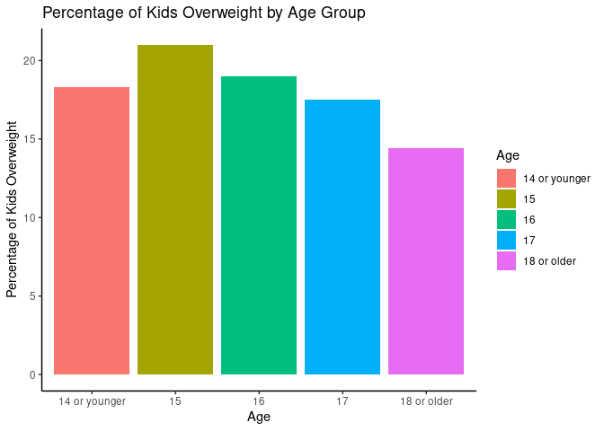

Project memo
================
Team name

This document should contain a detailed account of the data clean up for
your data and the design choices you are making for your plots. For
instance you will want to document choices you’ve made that were
intentional for your graphic, e.g. color you’ve chosen for the plot.
Think of this document as a code script someone can follow to reproduce
the data cleaning steps and graphics in your handout.

``` r
library(tidyverse)
library(broom)
```

## Data Clean Up Steps for Overall Data

### Step 1: \_\_\_\_\_\_\_\_\_

### Step 2: \_\_\_\_\_\_\_\_

## Plots

### ggsave example for saving plots

``` r
p1 <- starwars |>
  filter(mass < 1000, 
         species %in% c("Human", "Cerean", "Pau'an", "Droid", "Gungan")) |>
  ggplot() +
  geom_point(aes(x = mass, 
                 y = height, 
                 color = species)) +
  labs(x = "Weight (kg)", 
       y = "Height (m)",
       color = "Species",
       title = "Weight and Height of Select Starwars Species",
       caption = paste("This data comes from the starwars api: https://swapi.py43.com"))


ggsave("example-starwars.png", width = 4, height = 4)

ggsave("example-starwars-wide.png", width = 6, height = 4)
```

``` r
kids_overweight <- read_csv("/cloud/project/data/kids_overweight.csv")
```

    ## Rows: 5 Columns: 2
    ## ── Column specification ────────────────────────────────────────────────────────
    ## Delimiter: ","
    ## chr (1): Age
    ## dbl (1): Percentage
    ## 
    ## ℹ Use `spec()` to retrieve the full column specification for this data.
    ## ℹ Specify the column types or set `show_col_types = FALSE` to quiet this message.

``` r
kids_overweight |>
  ggplot(aes(x=Age, y=Percentage)) +
  geom_col() + 
  labs(title = "Percentage of Kids Overweight by Age Group", 
       x = "Age Group", 
       y = "Percentage of Kids Overweight")
```

<!-- -->

``` r
kids_overweight <- kids_overweight |>
  mutate(Age = fct_relevel(Age, "14 or younger", "15", "16", "17"))

# Plot histogram
ggplot(kids_overweight, aes(x = Age, weight = Percentage)) +
  geom_histogram(stat = "count", fill = "skyblue", color = "black") +
  labs(title = "Overweight Kids by Age",
       x = "Age",
       y = "Percentage of Overweight Kids") +
  theme_minimal()
```

    ## Warning in geom_histogram(stat = "count", fill = "skyblue", color = "black"):
    ## Ignoring unknown parameters: `binwidth`, `bins`, and `pad`

<!-- -->

``` r
family_support_data <- read.csv ("/cloud/project/data/love_support_family.csv")
```

``` r
view(family_support_data)
```

``` r
kids_overweight <- kids_overweight |>
  mutate(Age = fct_relevel(Age, "14 or younger", "15", "16", "17"),
         source = "Overweight Data")

family_support_data <- family_support_data |>
  mutate(Age = fct_relevel(Age, "14 or younger", "15", "16", "17"),
         source = "Family Support Data")

# Combine datasets
combined_data <- bind_rows(kids_overweight, family_support_data)

# Plot with clearer axis and spacing
ggplot(combined_data, aes(x = Age, weight = Percentage, fill = source)) +
  geom_histogram(stat = "count", position = position_dodge(width = 0.7), 
                 width = 0.6, color = "black") +
  labs(title = "Comparison: Overweight Kids vs Family Support by Age",
       x = "Age",
       y = "Percentage",
       fill = "Dataset") +
  theme_minimal() +
  theme(axis.text.x = element_text(angle = 45, hjust = 1),
        text = element_text(size = 12),
        legend.position = "top")
```

    ## Warning in geom_histogram(stat = "count", position = position_dodge(width =
    ## 0.7), : Ignoring unknown parameters: `binwidth`, `bins`, and `pad`

<!-- -->

``` r
ggplot(combined_data, aes(x = Age, y = Percentage, color = source)) +
  geom_point(position = position_dodge(width = 0.5), size = 4) +
  labs(title = "Comparison: Overweight Kids vs Family Support by Age",
       x = "Age",
       y = "Percentage",
       color = "Dataset") +
  theme_minimal() +
  theme(axis.text.x = element_text(angle = 45, hjust = 1),
        text = element_text(size = 12),
        legend.position = "top")
```

    ## Warning: Removed 12 rows containing missing values or values outside the scale range
    ## (`geom_point()`).

<!-- -->

``` r
data <- data.frame(
  Age = c("14 or younger", "15", "16", "17", "18 or older"),
  Overweight = c(18.4, 21.2, 19.0, 17.6, 14.3),
  FamilySupport = c(NA, NA, NA, NA, NA)  # Replace with actual values if available
)

# If you have FamilySupport values, add them here:
# data$FamilySupport <- c(value1, value2, ..., value5)

# Convert to long format
data_long <- data %>%
  pivot_longer(cols = c(Overweight, FamilySupport), 
               names_to = "Category", values_to = "Percentage")

# Plot
ggplot(data_long, aes(x = Age, y = Percentage, fill = Category)) +
  geom_bar(stat = "identity", position = position_dodge(width = 0.7), width = 0.6) +
  scale_fill_manual(values = c("Overweight" = "#66c2a5", "FamilySupport" = "#fc8d62")) +
  labs(
    title = "Comparison of Overweight Kids and Family Support by Age",
    x = "Age Group",
    y = "Percentage",
    fill = "Category"
  ) +
  theme_minimal(base_size = 14) +
  theme(axis.text.x = element_text(angle = 0, vjust = 0.5))
```

    ## Warning: Removed 5 rows containing missing values or values outside the scale range
    ## (`geom_bar()`).

<!-- -->


    ### Plot 1: Grade vs. Drinking data

    #### Data cleanup steps specific to plot 1

    These data cleaning sections are optional and depend on if you have some data cleaning steps specific to a particular plot


    ``` r
    family_support_data <- read.csv ("/cloud/project/data/love_support_family.csv")
    drinking_vs_family <- read.csv ("/cloud/project/data/drinking_fam_GRADE.csv")

    Drinking_vs_family <- drinking_vs_family |>
      mutate(
        Grade = fct_recode(Grade, 
                           NULL = "")
      )

    Drinking_data_cleaner <- read.csv("../data/drunk_high_data_2.csv")
    #Drinking_vs_family <- Drinking_vs_family |> 
     # as.numeric(GradePercent)
    #Drinking_vs_family <- Drinking_vs_family |>
     # as.numeric(FamGradePer.)

#### Final Plot 1

``` r
Drinking_vs_family |>
mutate('Grade' = fct_relevel(Grade,
                               "Grade 9", 
                               "Grade 10", 
                               "Grade 11", 
                               "Grade 12")) |>
  filter(!is.na(Grade) & !is.na(`GradePercent`)) |>
  ggplot(aes(x = Grade, y = `GradePercent`, fill = Grade)) +
  geom_col(na.rm = TRUE) +
  labs(x = NULL, 
       y = 'Percentage', 
       title = 'How many times in the past year have you been drunk/high at school?', 
       subtitle = "Grade vs. Percentage of Students Who Answered 'At Least One Time'")+
  theme_classic()
```

<!-- -->

``` r
ggsave("../plots/plot-1.jpg", width = 10, height = 4)
```

### Plot 2: Family support at home vs. Drinking Data

#### Plot 2 Cleanup

``` r
family_support_data <- read.csv ("/cloud/project/data/love_support_family.csv")
drinking_vs_family <- read.csv ("/cloud/project/data/drinking_fam_GRADE.csv")

Drinking_vs_family <- drinking_vs_family |>
  mutate(
    Grade = fct_recode(Grade, 
                       NULL = "")
  )
```

#### Final Plot 2

``` r
Drinking_vs_family |>
  mutate('Grade' = fct_relevel(Grade,
                               "Grade 9", 
                               "Grade 10", 
                               "Grade 11", 
                               "Grade 12"), 
         FamGradePer. = as.factor(FamGradePer.)
         )|>
  filter(!is.na(Grade) & !is.na(`GradePercent`)) |>
  ggplot(aes(x = Grade, y = `GradePercent`, fill = FamGradePer.)) +
  geom_bar(stat = "identity", position = "dodge") +
  labs(x = NULL, 
       y = 'Percentage', 
       title = 'Family support vs. being drunk or high at school by grade') +
  theme_classic()
```

<!-- -->

``` r
ggsave("../plots/plot-2.jpg", width = 10, height = 4)
```

### Plot 3: \_\_\_\_\_\_\_\_\_\_\_

### Plot 4: \_\_\_\_\_\_\_\_\_\_\_
